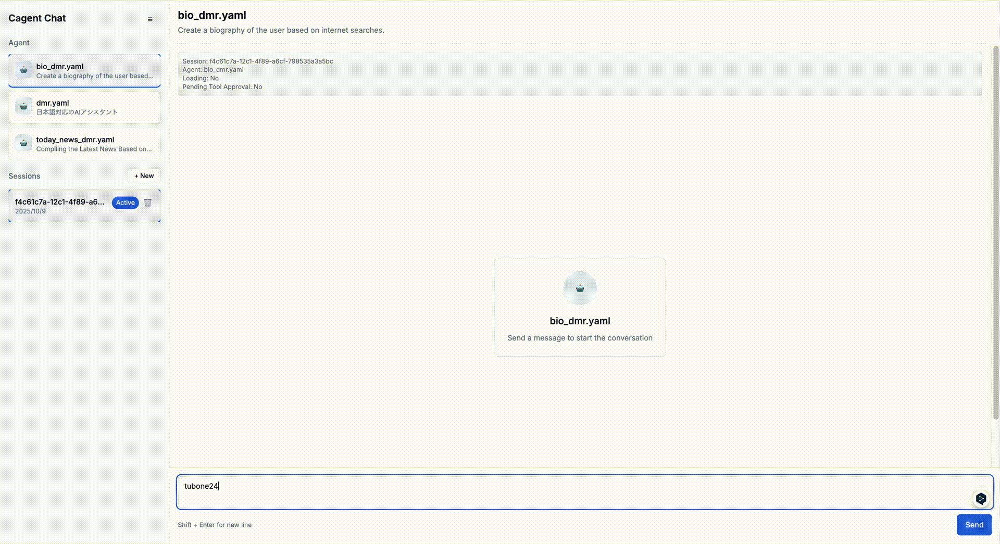
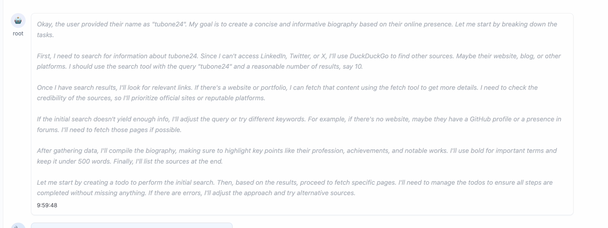
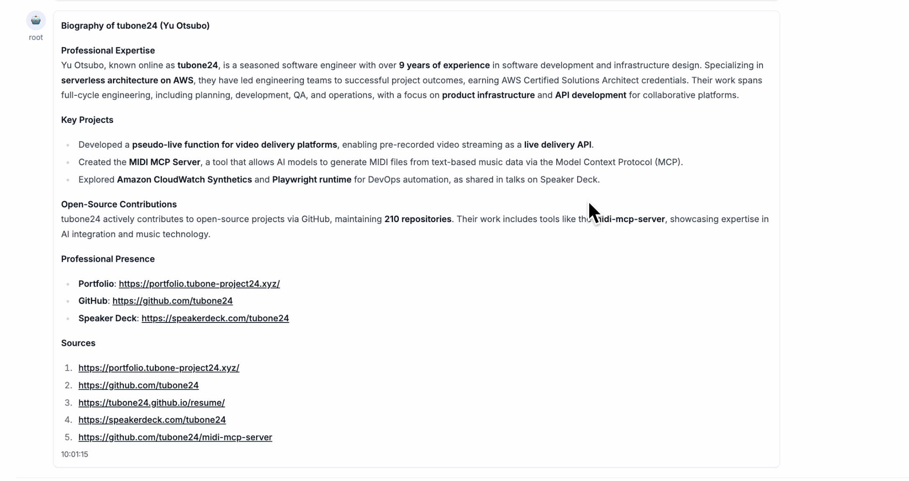
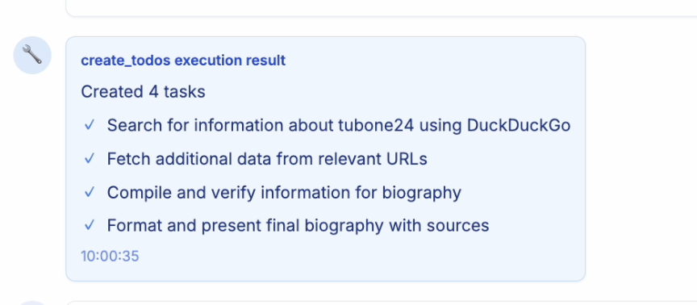
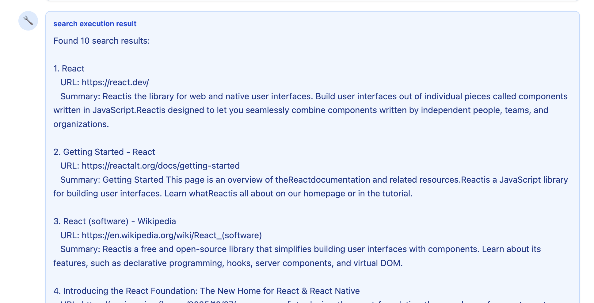

# Docker Cagent Playground

A web-based chat UI for interacting with Cagent agents.



## Installation Docker Cagent

### macOS (Apple Silicon)

```bash
curl -L -o cagent https://github.com/docker/cagent/releases/latest/download/cagent-darwin-arm64
chmod +x cagent
sudo mv cagent /usr/local/bin/
```

### macOS (Intel)

```bash
curl -L -o cagent https://github.com/docker/cagent/releases/latest/download/cagent-darwin-amd64
chmod +x cagent
sudo mv cagent /usr/local/bin/
```

### Linux (x86_64)

```bash
curl -L -o cagent https://github.com/docker/cagent/releases/latest/download/cagent-linux-amd64
chmod +x cagent
sudo mv cagent /usr/local/bin/
```

### Linux (ARM64)

```bash
curl -L -o cagent https://github.com/docker/cagent/releases/latest/download/cagent-linux-arm64
chmod +x cagent
sudo mv cagent /usr/local/bin/
```

### Windows

Download the latest release from [GitHub Releases](https://github.com/docker/cagent/releases/latest) and add the executable to your PATH.

## Usage

### Basic Usage

```bash
cagent run basic_claude_agent.yaml
```

### API Mode + Playground

You can start Cagent in API mode and interact with agents through the Web UI Playground.

#### 1. Start Cagent in API Mode

```bash
cagent api agents -l :8080
```

This command starts Cagent as an API server on port 8080.

#### 2. Start the Playground

In a separate terminal, run:

```bash
cd chat-ui
npm install
npm run dev
```

Once the playground starts, open your browser and navigate to `http://localhost:3000`.

#### 3. Environment Configuration (Optional)

By default, the Playground connects to the Cagent API server at `http://localhost:8080/api`. If you need to use a different port or host, create a `chat-ui/.env.local` file:

```bash
# chat-ui/.env.local
CAGENT_API_BASE_URL=http://localhost:8080/api
```

### Playground Features

This Playground is a web-based chat UI for interacting with Cagent agents. It provides the following features:

#### Main Features

- **Agent List Display**: View available agents in the sidebar
- **Agent Switching**: Select and switch between agents (automatically creates a new session)
- **Real-time Streaming**: Display agent responses in real-time
- **Reasoning Visualization**: Separate display of agent reasoning and final choices

  
  *Agent's reasoning process is displayed separately*

- **Markdown Support**: Messages are rendered in Markdown format (GFM supported)

  
  *Final answers are rendered with full markdown support*

- **Tool Execution Visualization**: Dedicated UI for tool calls and their results

  
  *Tool usage information is displayed with automatic approval notice*

  
  *Tool execution results are displayed with special formatting*

  
  *Example of search tool execution results with structured data*

- **Token Usage Display & Session Management**: Shows input/output token counts and session titles in the header

  
  *Session title and token usage statistics are displayed in real-time*

- **Streaming Control**: Ability to stop ongoing responses

## Deploy on Startup

```bash
cagent push ./basic_claude_agent.yaml username/my-claude-agent
```
